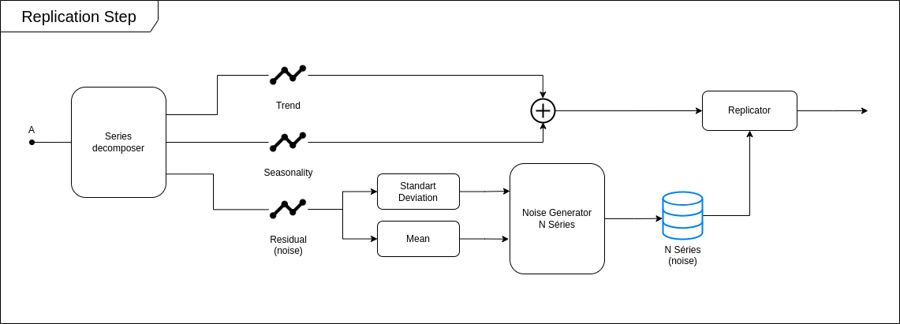

# Monte Carlo-Based Backtesting Analysis

"Backtesting is used in technical analysis to assess the viability of trading strategies without real capital by simulating past market conditions, considering factors such as historical data quality, strategy accuracy, and risk management." [1]

[1] [Quantified Strategies, Backtesting Technical Analysis (Results)](https://tradingstrategy.medium.com/backtesting-technical-analysis-bb34ec4b423c)

**Issue:** The historical series may have a noisy component that can lead to poor analysis.

**Solution:** By decomposing the series into trend, seasonality and residual (also known as noise), we can simulate many possible historical series. The noise can be composed of many types of interferences in stock prices: political and economic transition effects, speculative attacks, etc. So, the residual can well represent the transitory effects.

## Backtesting Analysis

Overview about the proposed method:

## Monte Carlo-Based Backtesting Analysis

Instead of doing just one simulation, we run many simulations, many variations of the past. 

### Monte Carlo Simulations

Using the historical series, we replicate the series N times, doing N simulations. The optimizer step will rank the best strategies (and parameters) for each company.

### Replication Step

We use the parts of the decomposed series to reconstruct a main series (clean signal), without the residual. With the residual, we generate N noisy signals (series) with the same standard deviation and mean (similar noisy properties) combining with the clean signal. This is the core of the method.

## Results:

|      | Backtesting Trad. | Backtesting MC |
|:-----|---------:|---------:|
|Return| +19.48% | +26.40% |

**Test-t:** `1.2130%` (<2%).